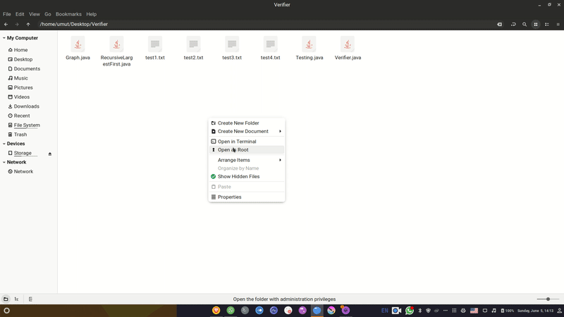
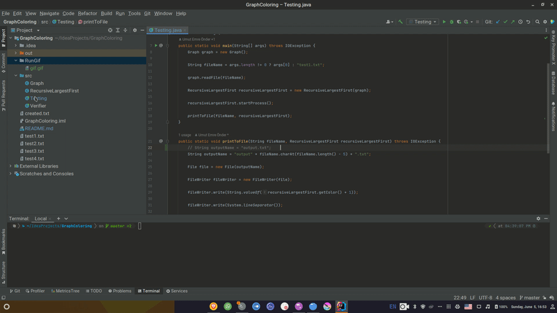

# Compare With Real Answers

|  Test File  | Number of Vertices | Number of Edges | Real Answer | Recursive Largest First's Answer |
|:-----------:|:------------------:|:---------------:|:-----------:|:--------------------------------:|
|  test.txt   |         5          |        5        |      3      |                3                 |
| sample1.txt |         87         |       812       |     11      |                11                |
| sample2.txt |        1000        |      24500      |     50      |               113                |
| sample3.txt |        500         |      58862      |     122     |               134                |
|  test1.txt  |        138         |       989       |      ?      |                11                |
|  test2.txt  |        500         |      62624      |      ?      |                65                |
|  test3.txt  |        1000        |     246700      |      ?      |               112                |
|  test4.txt  |        900         |     307350      |      ?      |               130                |

# How To Run

## Via Terminal
After compiling every ```.java``` file, write ```java Testing <fileName>.txt```. It will automatically create an output file with name ```output<lastCharOfInputFile>.txt```.

E.g. --> ```java Testing test1.txt``` will create ```output1.txt```. 



## Via IDE

To run via an IDE, you need to run ```Testing.java```. Before that you need to change the ```fileName```.




# Create Random Graph

To create a random graph change 12th line of ```Testing.java``` to ```graph.readFile(<numberOfVertices>);```


